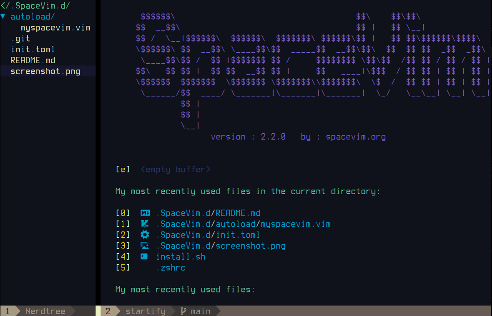

# SpaceVim.d

Custom [SpaceVim](https://spacevim.org/) configuration.
Adapted from [dark_powered.toml](https://github.com/SpaceVim/SpaceVim/blob/master/mode/dark_powered.toml) by Wang Shidong

- Enables [editorconfig](https://editorconfig.org/) for Vim
- Enables git & github integration
- Displays git status in filetree
- Moves NerdTree filetree to left
- Enables toml syntax highlighting
- Default theme: [molokai](https://github.com/tomasr/molokai)
- Additional themes:
  - [badwolf](https://github.com/sjl/badwolf)
  - [dracula](https://github.com/dracula/vim)
  - [jellybeans](https://github.com/nanotech/jellybeans.vim)
  - [vividchalk](https://github.com/tpope/vim-vividchalk)

